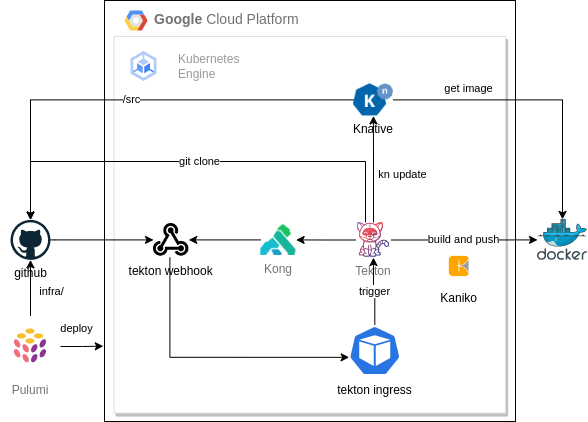

# Knative Kubernetes Cluster created using Pulumi (IaaC)
This project creates using Pulumi a K8s cluster and deploys the following middleware:
- Knative: serverless cloud agnostic framework.
- Kong: ingress controller for K8s.
- Tekton: Pipelines and triggers for CI / CD.

## PREREQUISITES

1. gcloud CLI and gke-gcloud-auth-plugin installed
2. docker CLI installed
3. kubectl installed
4. Having a docker hub (registry) account (https://hub.docker.com/)
5. pulumi CLI installed
6. Create and configure a pulumi account (https://www.pulumi.com/)

## BEFORE STARTING
### Create a Service Account in GCP with the following project roles:
- roles/compute.viewer (Visualizador de Compute)
- roles/compute.securityAdmin (Administrador de Seguridad de Compute)
- roles/container.admin (Administrador de Kubernetes Engine)
- roles/container.clusterAdmin (Administrador de clústeres de Kubernetes Engine)
- roles/container.developer (Desarrollador de Kubernetes Engine)
- roles/iam.serviceAccountAdmin (Administrador de cuenta de servicio)
- roles/iam.serviceAccountUser (Usuario de cuenta de servicio)
- roles/resourcemanager.projectIamAdmin (Administrador de IAM de proyecto)
- roles/compute.networkAdmin (Administrador de red de Compute)

### Activate the following APIs on the project where the Service Account was created:
- Compute Engine API - compute.googleapis.com
- Kubernetes Engine API - container.googleapis.com

### Configure gcloud (CLI) using the service account previously created
- Creates keys for service account (json file) and use it for gcloud auth:
    gcloud auth activate-service-account <account> --key-file=<json_file>

## ARCHITECTURE

## RUNNING PULUMI
### Create GKE cluster
    $ cd k8s
    $ pulumi up

### Deploy Knative, Kourier, Kong and Tekton
    $ cd ../tools
    $ pulumi up

### Services
    $ cd ../svcs
    $ pulumi up

### Deploy CI / CD

Change IP at ingress-run.yaml and webhook-run.yaml using Kong Proxy IP:

> value: webhook.**34.23.206.4**.nip.io

Adjust docker hub and github secrets:
- github: https://tekton.dev/docs/how-to-guides/clone-repository/#git-authentication
- docker: https://tekton.dev/docs/how-to-guides/kaniko-build-push/#tabs-1-0
- webhook: Create a GitHub Personal Access Token with the following access privileges:

   - `public_repo`
   - `admin:repo_hook`

This token can contain any plain text string.

    $ cd ../cicd
    $ pulumi up

## AFTER RUNNING PULUMI
### Kubeconfig
    $ cd ../k8s
    $ pulumi stack output kubeconfig --show-secrets > $HOME/kubeconfig.yaml
    $ export KUBECONFIG=$HOME/kubeconfig.yaml
